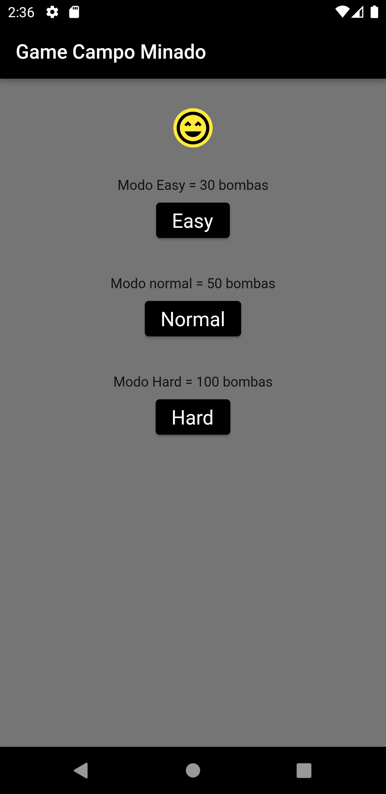
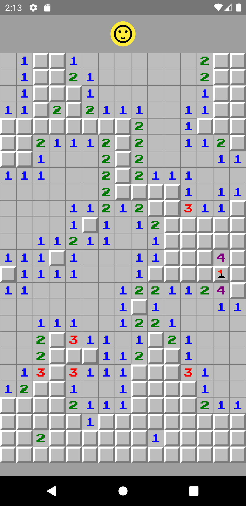
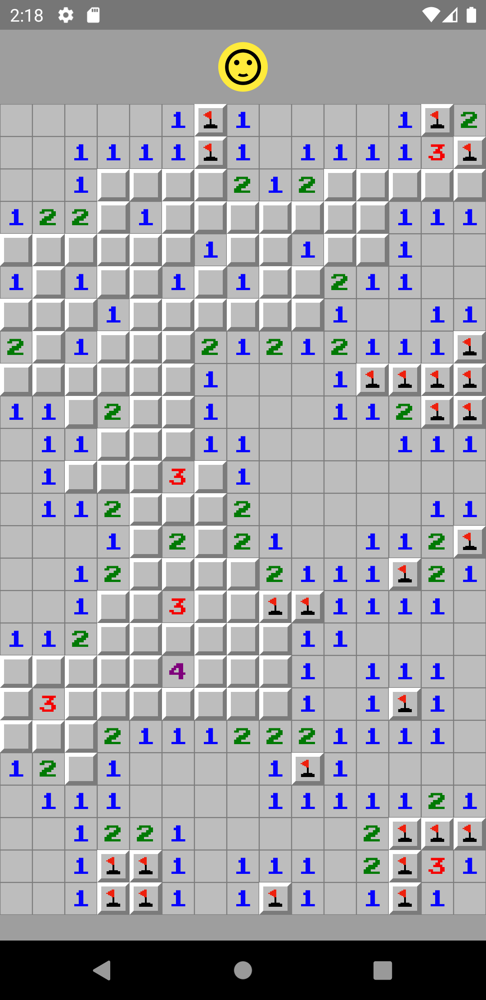
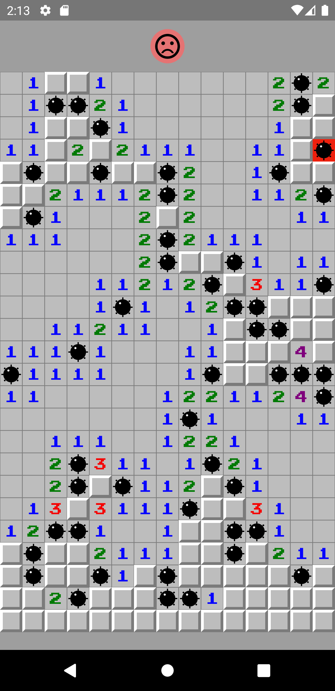

# campo_minado

A projeto de um jogo de campo minado que eu fiz no curso do site udemy da cod3r.

O menu do game mostra a dificuldade que o usuário vai ter que escolher entre Modo Easy e Normal ou Hard.

 &nbsp;&nbsp;&nbsp;&nbsp;  

# 

O Jogador pode perda e segurar no campo para sinalizar quando achar que é um campo minado

  &nbsp;  &nbsp; 
